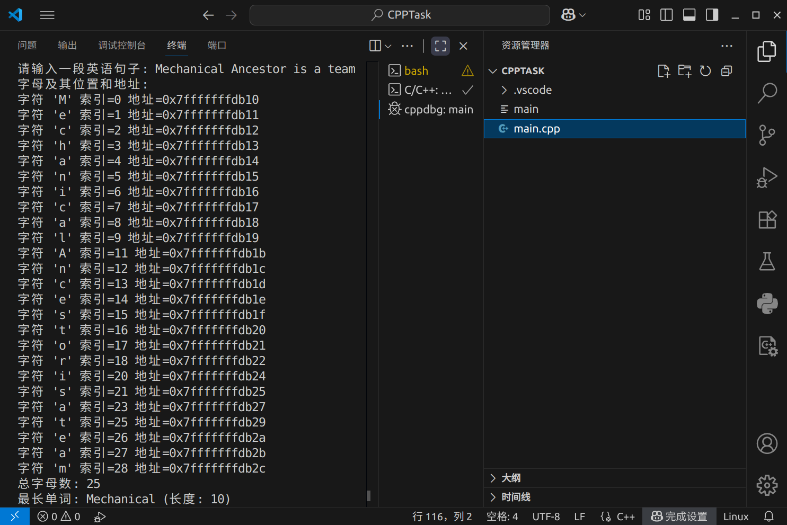
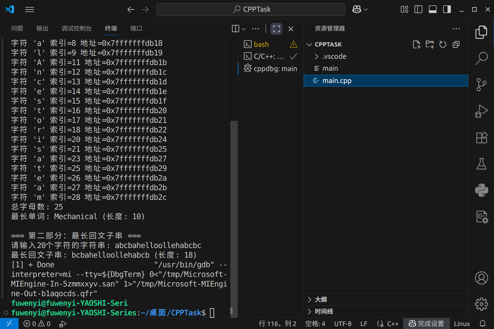

# 第三次考核提交

## 运行结果截图

  
  

## 运行结果

### 第一部分：英语句子处理
- 总字母数：25
- 最长单词：Mechanical（长度：10）

### 第二部分：最长回文字串  
- 输入字符串：abcbahelloollehabcbc
- 最长回文字串：bcbahelloollehabcb（长度：18）

## 实现说明
- 使用 C++ 实现，符合指针和字符数组的要求
- 第二题使用指针寻址，未使用数组下标操作
- 程序运行正常，功能完整实现

