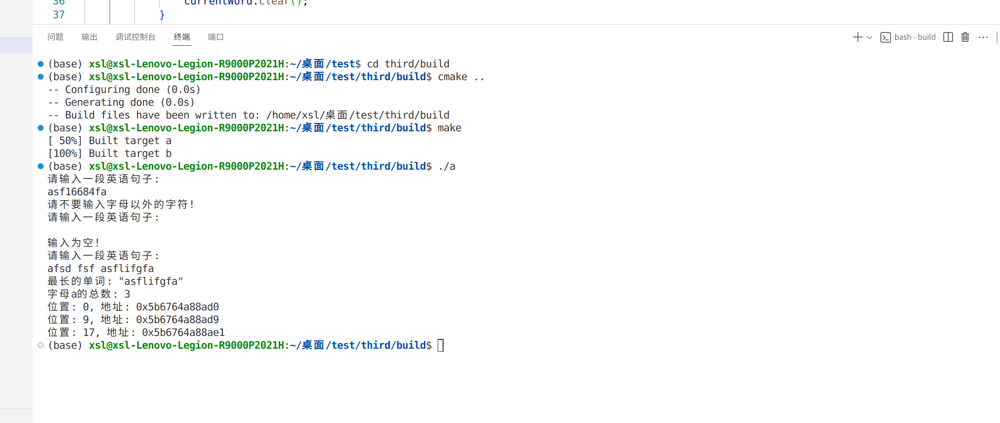
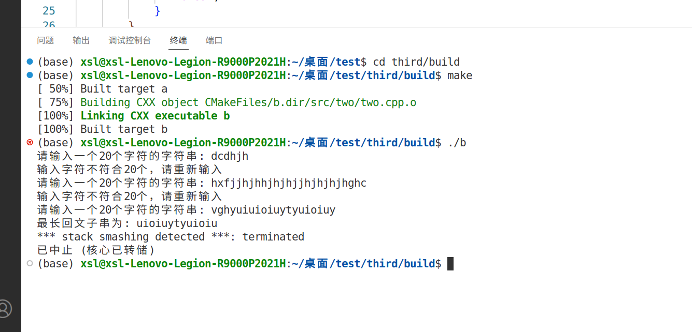
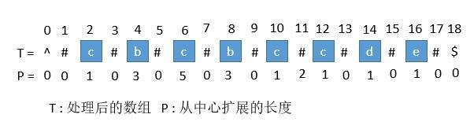
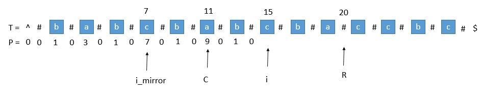

# task3的第一个任务：

# task3的第二个任务：

# 马拉车算法（Manacher's Algorithm）：
用于查找一个字符串的最长回文子串的线性方法
- 将时间复杂度为线性，$O(n)$
- 回文串：连续相邻的、对称的字符串
  
>**中心扩展算法（朴素算法）：**  
>在字符串中选择每一个点为中心对称点（回文中心），进行左右扩展，判断其左右对称位置的字符是否相等，每次保留最长回文子串的长度。因为字符串存在奇数和偶数长度，所以有两种中心点：<u>字符为中心</u>和<u>两个字符之间为中心</u>，总共有$2n-1$个中心。
>- 时间复杂度：$O(n^2)$——两层循环，每层循环都是遍历每个字符
>- 空间复杂度：$O(1)$

## 填充特殊字符：
为了解决奇数和偶数长度的回文串的中心点不同的问题，所以在每个字符两侧插入特殊字符（通常为`#`，也可以是其他字符），作为*占位符*，将所有字符串的长度都统一成奇数。而且有的为了防止在扩展时越界，在字符串的两端分别添加不同的特殊字符（不同字符一定不是回文串），一般为`^`和`$`，使扩展到边界后自动结束。填充后的新字符串长度为$2n+3$。如：`^#a#b#c#d#$`

设字符串（已填充）为$s$；$i$为字符串中字符的下标（位置），也代表当前进行查找的回文中心的位置；$s[i]$为下标对应的字符；$d[i]$为以$s[i]$为中心的回文字符串的长度；$p[i]$为以$s[i]$为中心的回文串的半径长度（包括$s[i]$），初始值即为1；而$p$表示一个数组，元素即为所有$p[i]$；$c$表示当前已知的回文中心中最靠近右端的回文中心位置；$r$表示$c$回文的最右边界的位置；$l$表示$c$回文的最左边界的位置；回文串$c$可以表示为$s[l,r]$
- 注：以上的编号、长度等参数都包括了插入的特殊字符
  - $p[i]$所表示的半径长度包括了特殊字符,但不包括回文串端点处的特殊字符。对于该回文实际长度（去掉特殊字符）就为$p[i]$  

Manacher算法本质上就是中心扩展算法，但Manacher算法在中心扩展算法的基础上利用已知回文的信息来省略重复的计算。两者都是从左向右处理字符串：
- 中心扩展算法是从左向右遍历整个字符串，每一个字符的回文都要通过向两边扩展来查找
- Manacher算法是从左向右遍历整个字符串：
  - 先进行中心扩展算法，找到第一个回文串，将其中心设为$c$
  - 继续向后对中心$i$查找回文
      - 若$i$在回文串$c$的覆盖范围内，即$i < right$，则可利用回文的对称性：找到$i$相对于$c$的对称点$j$，$j=2c-i$，根据回文的对称性简化$p[i]$的计算：
          1. 当$p[j]$不超过$r-i+1$时，$p[i]$至少等于$p[j]$，然后再在$i+p[j]-1$位置开始对$i$进行中心扩展，得到最终的$p[i]$
          2. 当$p[j] > r-i+1$时，$p[i]$的长度至少等于$r-i+1$，然后再在$r+1$位置开始对$i$进行中心扩展
      - 若$i$不在回文串$c$的覆盖范围内，即$i \geq right$（$i$不会在$c$的左侧：从左开始查找，下一个回文一定在$c$的右侧），则继续使用中心扩展算法
  - 当$i$扩展后，若$i$的右边界超过了$c$的右边界$r$，则更新$c$为$i$，$r$为$i+p[i]-1$
  - 当所有字符遍历完后，遍历$P$数组，找到最大值  
